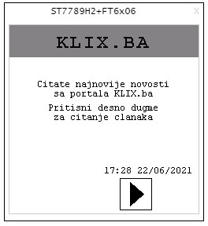

# RSS-feed-Arm-Mbed-OS-Simulator

Elektrotehnički fakultet Sarajevo  
Ugradbeni sistemi       

    Specifikacija projekta

                                                      
 
Cilj projetka je poruku sa odabranog RSS feeda prikazati na displeju u Mbed simulatoru.
RSS predstavlja način za automatsko preuzimanje informacija sa web lokacija koje nam se sviđaju,
te nam služi kako bi mogli sadržaje pregledati pomoću preglednika, posebnih programa ili koristiti na svojim stranicama. 

U ovom projetku taj sadržaj će biti najnovije novosti odnosno naslovi sa Klix.ba portala, a taj sadžaj ćemo pregledati pomoću ST7789H2 LCD-a.

RSS Klix-a svoje podatke čuva u XML formi na linku: https://www.klix.ba/rss.

Mbed ne podržava način kojim bi preuzeli podatke sa gore navedenog linka, te bi najjednostavniji način za to bio napisati kratki program u 
Python-u koji sadrži funkcije za dobavljanje podataka sa http protokolom. 
Kako bi poruke iz Pythona dobili u Mbed simulatoru koristit ćemo MQTT gdje bi Python bio publisher a Mbed subscriber.

Zamisao projekta je da na početku programa na displeju korisnik bude obavješten o tome da čita naslove sa portala Klix.ba. 
Klikom na dugme korisnik bi započeo sa čitanjem naslova gdje bi se na displeju svaki naslov ispisivao pojedinačno, te bi 
korisnik pomoću dva dugmeta navigirao kroz naslove gdje bi znao koji članak čita po redu tako što bi na displeju bio porukom obavješten o tome.

Pored toga, u donjem uglu displeja će biti prikazano trenutno vrijeme i datum.

   
Slika 1: Izgled naslova na Klix.ba portalu
 

       Slika 2: Izgled početnog ekrana  &emsp;&emsp;&emsp; Slika 3: Prikaz naslova sa slike 1
